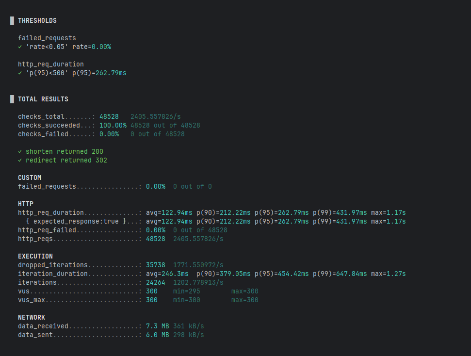

# URL Shortener

A production-style full-stack URL shortening service built with real-time analytics tracking for clicks, location, and client type.

## Table of Contents
- [Tech Stack](#tech-stack)
- [Frontend](#frontend)
- [Backend](#backend)
- [Performance and Concurrency Highlights](#performance-and-concurrency-highlights)
- [Functionality Testing](#functionality-testing)
- [Performance Testing](#performance-testing)
- [Demo](#demo)

Features:
- Shorten long URLs into short codes.
- Redirect short URLs to their original destination.
- Track click analytics (timestamp, IP, user agent, location).

---

## Tech Stack
- **Backend**: Java, Spring Boot, Spring Data JPA, PostgreSQL
- **Frontend**: React, TypeScript, React Router, Tailwind
- **Database**: PostgreSQL
- **Build/Deploy**: Docker, Docker Compose

---

## Frontend
**Implementation Highlights**
- **React Hooks** (useState, useEffect, useMemo) used extensively for state management and performance optimisation.
- **Custom Hooks:**
  - useFetch handles API calls and manages loading, error and data states. Utilises fetchWrapper and the ApiError Type for consistent error handling.
  - useNotification displays toast notifications for validation errors or server issues.
- **Key Components:**
  - UrlShortener handles submission, calls the short code API and displays the new short code as a clickable link.
  - InputBar manages controlled input state and clears after submission.
  - DataTable renders tabular data, taking header and row arrays to display analytics results cleanly.
  - Chart components (line, bar, pie) receive labels and data arrays ensuring efficient rendering through memoisation.

 **State and Data Flow:**
- submittedUrl triggers fetch calls when updated.
- API call arguments are memoised via useMemo to avoid unnecessary recomputation.

**UX Notes:**
- Loading spinner displayed during API request to shorten a URL.
- Skeleton cards are displayed during API requests for analytics.
- Clickable short URLs open in new tabs.
- Input validation prevents empty or invalid URLs.
- Errors are notified via toast notifications for clarity.

---

## Backend
**Key Components and Patterns**
- RedirectController:
  - Handles GET requests for short URLs and resolves the original URL via UrlService.
  - Triggers AnalyticsService to track clicks and returns an HTTP 302 redirect.
- UrlService:
  - accessUrl(String shortUrl) fetches the URL entity within a @Transactional method.
  - Updates the lastAccessedDate asynchronously via a @Modifying query:
  - Guarantees concurrency safety without locks, multiple threads can update the same row without overwriting each other's updates
  - The asynchronous update ensures the redirect response is not delayed.
- AnalyticsService:
  - Tracks click events asynchronously.
  - Parses user agents to determine client type and extracts geolocation data from IPs (the IP is not persisted).
  - Queues click events and performs batch inserts to the database to reduce load.
  - Time Series Trends
    - Provides daily click counts for the last N days.
    - Fetches raw click event data using a custom repository query (findClicksTrend) and aggregates it by date.
    - Returns a continuous series with zero-filled dates to avoid gaps in charts.
    - Used by frontend line charts to display trends over time.
- GlobalExceptionHandler:
  - Provides consistent JSON error responses for exceptions such as UrlNotFoundException (404) and UrlUpdateFailedException (409).
  - Ensures frontend receives structured error messages with timestamps and descriptions.
 
**API Endpoints**
| Method | Endpoint             | Description                                                           |
| ------ | -------------------- | --------------------------------------------------------------------- |
| POST   | `/api/url`           | Accepts a long URL and returns a short code.                          |
| GET    | `/{shortUrl}`        | Redirects to the original URL and tracks analytics.                   |
| GET    | `/api/analytics/...` | Fetches aggregated click data for charts (e.g., by browser, country). |

## Performance and Concurrency Highlights:
- Indexed critical fields and custom queries optimise analytics retrieval.
- Hikari connection pool tuned for high concurrency:
  - maximum-pool-size=50, minimum-idle=10
- AnalyticsService queues click events and performs batch inserts to reduce DB load.
- Flush intervals and maximum batch sizes are configured to balance latency and efficiency.
- Asynchronous processing via a custom ThreadPoolTaskExecutor:
  - Core pool: 50, max pool: 200, queue capacity: 500
  - Ensures that redirects and other frontend-facing requests aren’t blocked by analytics processing.
- @Transactional and atomic UPDATE ensure concurrency safety for lastAccessedDate updates without pessimistic locks.
- Overall setup allows high throughput with minimal latency even under stress testing.

---

## Functionality Testing
To ensure reliability and correctness of the URL Shortener service, comprehensive unit and integration tests were implemented for both backend and frontend components.

**Backend Tests**
- Unit Tests:
  - JUnit + Mockito used to test individual services, repository methods and utility classes.
  - Verified URL shortening, redirect logic, analytics tracking and exception handling.
- Integration Tests:
  - Spring Boot test slices to verify REST endpoints (/api/url, /{shortUrl}, /api/analytics/...) against an in-memory or Dockerised PostgreSQL instance.
  - Confirmed correct database writes, transactional consistency, and concurrency-safe updates (e.g., lastAccessedDate and click events).
- Coverage: Achieved ~70% coverage across services and repositories, including edge cases such as invalid URLs and concurrent requests.

---

## Performance Testing
To validate the efficiency and concurrency safety of the URL Shortener service, a series of load tests were conducted using k6.

**Test Setup**
- **Tool:** k6
- **Environment:** Local development machine, with the application, PostgreSQL database (running in a Docker container), and load generator all on the same host
- **Database:**  PostgreSQL
- **Duration:** 20 seconds sustained load (also verified with longer runs exceeding several minutes)
- **Target rate:** 3000 requests/second
- **Max Virtual Users:** 300
- **Endpoints tested:**
  - POST /api/url - Create short URL
  - GET /{shortCode} - Redirect

**Results Summary**
| Metric                   | Result                                              |
| ------------------------ | --------------------------------------------------- |
| Successful requests      | **100% (0 failures)**                               |
| Average request duration | **~122 ms**                                         |
| 95th percentile latency  | **~262 ms**                                         |
| Peak throughput          | **~2,400 requests per second**                      |
| Database                 | All writes batched asynchronously with no data loss |

**Interpretation**
- The service consistently handled 2.4K requests per second with zero failed requests.
- The 95th percentile latency maintained under 300ms, demonstraiting excellent responsivess under load.
- Results reflect full-stack performance as all requests triggered  real database reads and writes.
- No concurrency issues were observed thanks to the asynchronous queueing and batch inserts.
- Longer-duration tests (minutes rather than seconds) showed no degradation in performance, confirming stability and reliability of the asynchronous batch writes.

**Limitations**
- These tests were executed on a single local machine, with the application server and load generator competing with CPU resources.
- Throughput  is limited by hardware, not by application design.
- Running the same test on a dedicated server environment would likely yield significantly higher throughput.

**Conclusion**
Despite running on a constrained local setup, the system demonstrated strong scalability and concurrency safety, efficiently handling thousands of requests per second with consistent performance and no failures.

---

## DEMO
**Large Screen Demo:**

**Small Screen Demo:**

